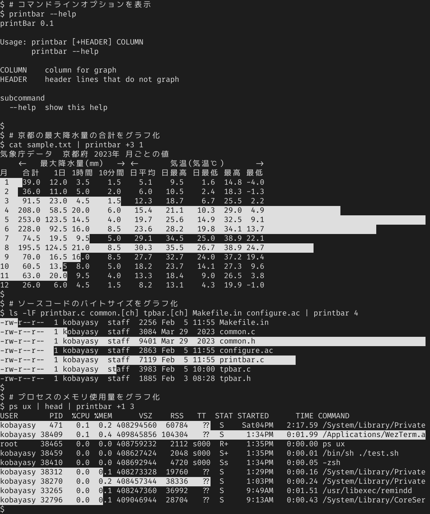

<!--
README_ja.md - Last modified: 05-Feb-2026 (kobayasy)
-->

[
	[インストール](#使い方) |
	[使い方](#使い方)
]
// [英語(English)](README_en.md)

---

[](https://github.com/kobayasy/printBar/actions/workflows/build-macos.yml)
[](https://github.com/kobayasy/printBar/actions/workflows/build-linux.yml)
/
[](https://github.com/kobayasy/printBar/actions/workflows/codeql-analysis.yml)

コンソール出力に棒グラフを重ねて表示します。
Terminfo が使えるPOSIX準拠のOSならば動作するはずです。

### インストール
1. 下記コマンドでビルドとインストールをします。
```sh
curl -LOJs https://github.com/kobayasy/printBar/releases/download/1.2/printBar-1.2.tar.gz
tar xzf printBar-1.2.tar.gz
cd printBar-1.2
./configure --prefix=$HOME
make install
```

2. PATH に `~/bin` が含まれていない場合は追加してください。

### 使い方
1. 下記コマンドで使い方が表示されます。
```sh
printbar --help
```

実行例:

